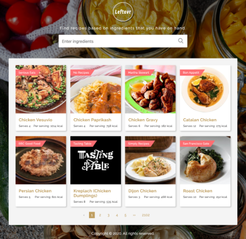

# Leftovr

> Find recipes based on ingredients that you have on hand.

[Online Demo](https://leftovr.netlify.app/)




Leftovr is a responsive single page web application which allows a user 
to enter one or more ingredients to find matching recipes.

It's built on Next.js - based on the React framework but 
using server side rendering rather than client side for consistent performance
and to allow for better Search Engine Optimisation (SEO).  

The application relies on the Edamam Recipe API to supply data. Note that
this is the free version and therefore limited to 5 requests per minute.

The project is fully automated with a continuous deployment pipeline via Netlify.

---

### Built With

* [React](https://reactjs.org/) - Javascript frontend framework
* [Next.js](https://nextjs.org/) - Server side rendering
* [NPM](https://www.npmjs.com/) - Javascript package management
* [Styled-components](https://github.com/styled-components/styled-components) -  CSS in JS
* [Edamam](https://www.edamam.com/) - Recipe Search API
* [Netlify](https://www.netlify.com/) - CI/CD and hosting

### CI/CD

- Build, test, and deploy to Netlify platform.
- Automation integration with Github

### Setup

> install and run locally

```
$ npm install 
$ npm run dev
```

> open the url

```
http://localhost:3000/
```

### Author

- [Jessie Wang](https://github.com/koalamango)

### License

[](http://badges.mit-license.org)

